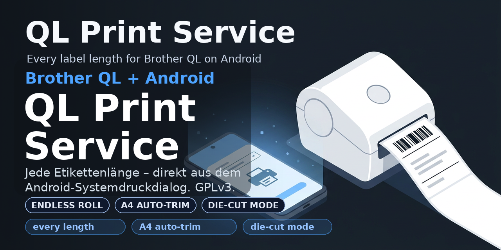

  

<h1 align="center">Hi, ich bin networxnet 👋</h1>

<em>Ich baue Software, die echte Probleme löst – am liebsten schlank, ohne unnötige Abhängigkeiten und als Open Source.</em>

---

## 🔭 Aktuell: [QL Print Service for Android](https://github.com/networxnet/Brother-QL-Printservice-for-Android)

Geboren aus echtem Frust: Die offizielle Brother-App kennt nur feste Etikettenformate – aber Versandetiketten von der Endlos-Rolle haben **jede Länge**. Also habe ich einen eigenen Android-Druckdienst geschrieben.

- 📏 **Endlos-Rollen in jeder Länge** – die Etikettenlänge wird pro Druck automatisch ermittelt
- ✂️ **A4-PDFs automatisch zuschneiden** – leere Ränder verschwinden vor dem Druck
- 🏷️ **Die-Cut-Formate** – feste Etiketten mit passgenauer Skalierung
- ✅ **Getestet bis aufs Byte** – die CI vergleicht den Druckdatenstrom mit der Referenz-Implementierung *brother_ql*
- 📦 **Null Abhängigkeiten, kein Kotlin, kein Tracking** – pures Java mit Android-SDK

➡️ [Releases & APK-Downloads](https://github.com/networxnet/Brother-QL-Printservice-for-Android/releases) · [Discussions – Fehler, Ideen, Drucker-Setups](https://github.com/networxnet/Brother-QL-Printservice-for-Android/discussions) · [Deutsche Doku](https://github.com/networxnet/Brother-QL-Printservice-for-Android/blob/main/README.de.md)

## 📫 Mich erreichen

Am einfachsten über die [Discussions](https://github.com/networxnet/Brother-QL-Printservice-for-Android/discussions) meiner Repos – Fehlerberichte, Verbesserungsideen oder einfach dein Drucker-Setup.

Wenn du meine Arbeit unterstützen möchtest: **[GitHub Sponsors](https://github.com/sponsors/networxnet)** ❤️

---

*Alles, was ich veröffentliche, steht unter freien Lizenzen (GPLv3) – damit es für immer frei bleibt.*
